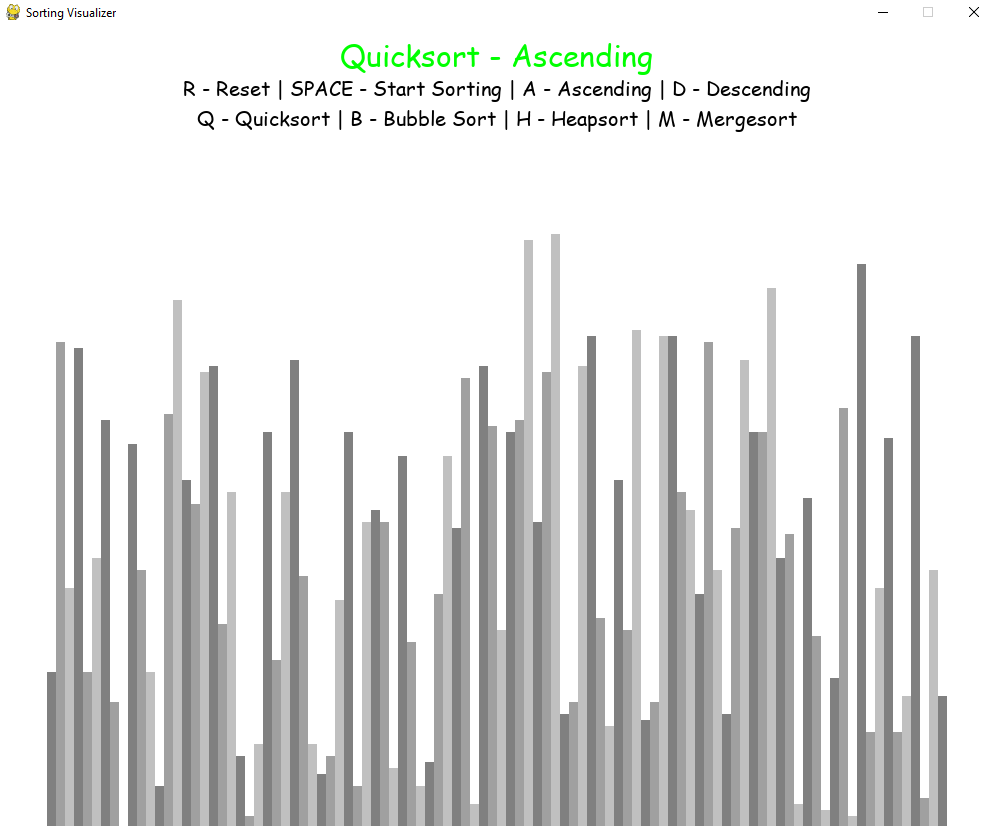

# Sorting Visualizer

### Tools and Programming Language:
> - <p>Python<p> 
> - <p>PyGame module<p>
> - <p>IDE: Sublime Text<p>

<br/>

---
<br/>

### Description:

<p>The purpose of this application is to show, from a visual perspective, how the most common sorting algorithms work <p>

<p>The application allows you to generate a random list of numbers which will be sorted<p>

<p>Than you can choose the sorting algorithm you wish and select "Ascending" or "Descending" mode<p>

<br/>

---
<br/>

### Execution:
To execute the program use the following command:
  ```
  python SV.py 
  ```

or
```
python3 SV.py 
```

_it's recommended to use pyhton3 and you need Pygame module installed on your system_


<br/>

---
<br/>

### Pictures:

